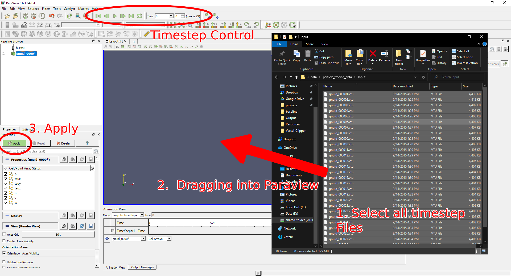
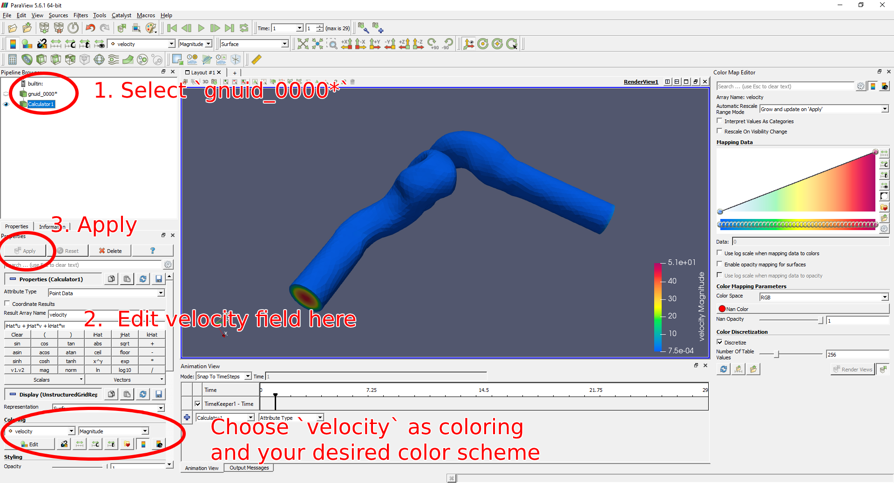
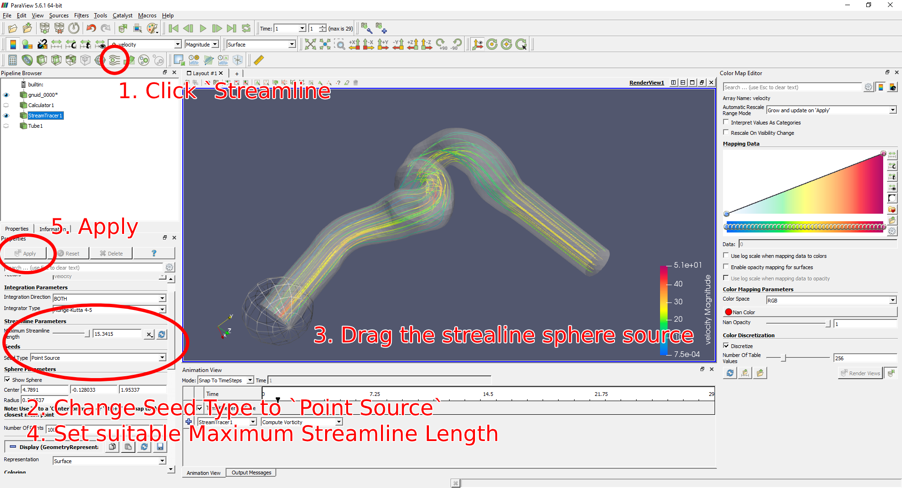
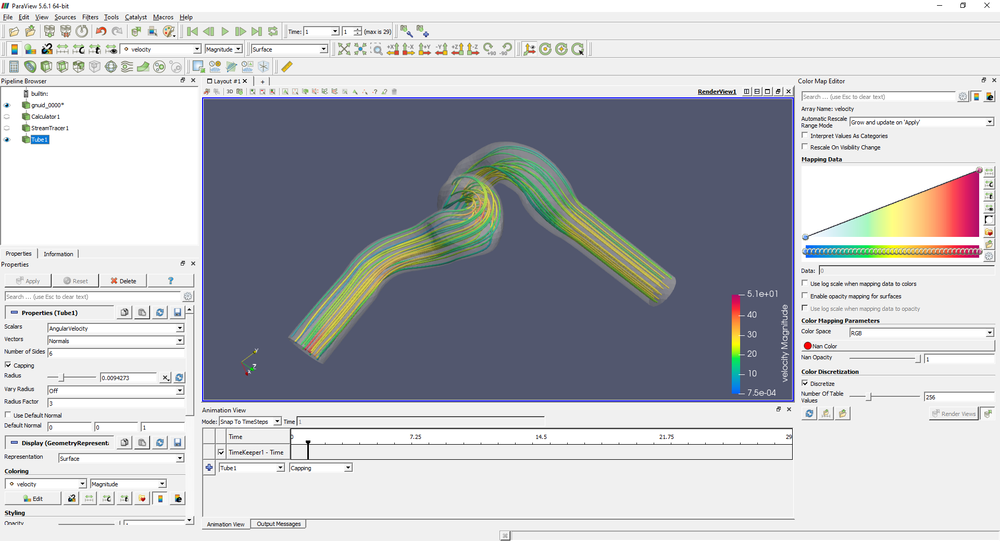

# CFD Result Animation

This article is a tutorial for CFD result animations using particle tracing, streamline or streaklines.

## Sample Data
Sample data can be downloaded [here](https://s3.amazonaws.com/data-orbx/particle_tracing_data.zip)

The dataset contains two folders:
- Input
	- gnuid_\[timestep\].vtu
- Output
	- mesh_timesteps.vtu
	- source.vtp
	- traces.vtp

## Paraview
Paraview is powerful GUI software for scientific data rendering. The software is the official post CFD viewer for OpenFOAM and Nvidia SimNet. With adequate IO interfaces, Paraview could also load CFD results from Ansys Fluent and CFX using proper file type outputs. Here we will provide a tutorial to generate animation for CFD results.

### Loading Temporal Data
Loading temporal data into Paraview is easy, first select all necessary timestep files, dragging into Paraview Window, Then Click `Apply`

### Streamline
1. Velocity field
	In most CFD software the output velocity  will be store as a 3D vector data field. But in sample dataset, we have to combine 3 scalar fields to generate the velocity vector field. Taking `gnuid_\[timestep\].vtu` as example:
	1. Select `gnuid_0000*` in Pipeline Browser at left of Paraview
	2. Filters -> Alphabetical -> Calculator
	3. Result Array Name = 	`velocity`
	4. The function is `iHat*u + jHat*v + kHat*w`
	5. Click `Apply`

	
2. To generate streamline of velocity field
	1. Click Streamline
	2. Change Seed Type to `Point Source`
	3. Drag the sphere to flow inlet
	4. Set the suitable Maximum Streamline Length to fill up the domain
	5. Click `Apply`
	
	3. (Optional) If you want a thicker streamline, Filters -> Alphabetical -> Tube -> Set Radius -> Apply
	

### Particle Tracing
After creating streamline in Paraview, it is possible to trace the movement of particles.

1. Contour -> Properties -> Contour by `IntegrationTime`
2. Glyph
	- Glyph Source -> Glyph Type set to `Sphere`
	- Scale -> Scale Array -> `No scale array`
3. View -> Animated View
	- Column 1 -> Select `Contour 1`
	- Column 2 -> Select `Isosurfaces`
	- Click `+` at left most column
	- Double click at the interpolation icon to change Animation Keyframes
	- Time = <starttime>, Value = <starttime>, Time = <endtime>, Value = <endtime> -> OK
	- Click `Play`
	- To make the animation more smooth/ slow motion, increase the No. of Frames 
4. File -> Save Nomination -> Choose the desire output location -> Frame Rate = <No. of Frames>/((<starttime> - <endtime>)/ <playspeed>) 
	For example, to play a 3 second (0-3 second) video (number of frames = 300) in 0.25x speed, you will need a output FPS at 300/((3-0)/0.25) = 25FPS. The result video will have length of 12 seconds.

## VTK + VMTK
The underlying visualization function of Paraview is supported by open source toolkit [VTK](https://vtk.org/). Users may write their own scripts in C++/Python to speed up the animation process. For toolchain convenience I will introduce the working principle with the aid of C++ codes. 

[VMTK](http://www.vmtk.org/index.html) is an extension library of VTK which focus on blood vessel operations. The toolkit includes numerous of useful functions that can better manipulate with CFD results. 

### Loading Temporal Data

### Streamline

### Particle Tracing

### Streakline

## References
[ParaView - Particles and streamlines](https://www.youtube.com/watch?v=Dk91aLVpwXc&ab_channel=CFDFEASERVICE)
[VMTK Particle Tracking](http://www.vmtk.org/tutorials/ParticleTracing.html)